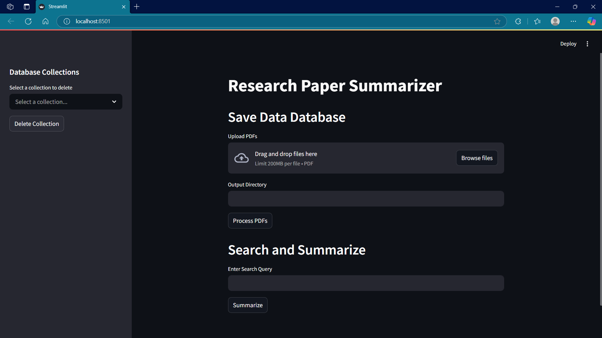

# 🧠 Research Paper Summarizer

Developed during an NVIDIA Internship, this project is an end-to-end platform that helps researchers quickly analyze and extract key insights from academic papers using semantic search, vector databases, LLM-powered summarization, and LaTeX PDF generation.

## 🔍 What It Does

- 📥 Upload PDFs of research papers via a user-friendly Streamlit interface.

- 🧠 Parse and embed the content using Llama Cloud API, Sentence Transformers, and convert to Markdown + JSON.

- 📚 Store embeddings in Milvus, a scalable vector database.

- 🔎 Perform Semantic Search based on user queries (content, abstract, images, etc.).

- 🧾 Generate Section-wise Summaries (Abstract, Introduction, Methodology, Results, Conclusion, References, and even Figure Captions).

- 📄 Output a LaTeX-based PDF — beautifully structured, citation-ready, and exportable.

## 🛠️ Technologies Used


| Tool/Library               | Purpose                        |
|-------------------------|------------------------------------------|
| Streamlit              | Web UI for uploading, searching |
| LlamaParse (Llama Cloud) | PDF parsing and Markdown generation                        |
| Pymilvus                    | 	Vector database storage/search                         |
| Sentence Transformers        | Embedding generation for search                          |
| Gemini API                | Summarization & captioning via LLMs                        |
| LaTeX (arxiv cls)                    | Academic formatting for output PDF          |

## 📦 Features

- 📂 Multi-PDF upload & processing.

- 📄 Markdown and JSON generation with structural hierarchy.

- 🖼️ Intelligent image extraction with auto-captioning.

- 🧠 Section-specific summarization (Abstract, Intro, Methods, etc.).

- 🧾 Formatted references in IEEE style.

- 🧑‍🔬 Literature review generation via citation understanding.

- 📊 Final output in a two-column LaTeX-formatted PDF (like IEEE/Arxiv style).

## 🚀 How It Works

1. 🔧 Upload and Process PDFs
   - PDFs are parsed and converted to Markdown + JSON.
   - Headings, subheadings, content, and images are extracted and embedded.

2. 💾 Store to Milvus
   - Data is vectorized and stored by topic/section-wise embeddings using Pymilvus.

3. 🔍 Semantic Search
   - Enter a query (e.g., "Convolution") to fetch top-matching excerpts.
   - Gemini API processes and summarizes the content per section.

4. 🧾 Generate PDF
   - Markdown output is converted to LaTeX using ToLatex.py.
   - A polished PDF is compiled with structure, images, and references.
  
## 📁 Project Structure
```
.ResearchPaperSummarizer
├── data/
│   └── (Contents of the data directory - e.g., sample_data.csv)
├── extracted/
│   └── (Contents of the extracted directory)
├── images/
│   └── (Contents of the images directory - e.g., logo.png)
├── latex-output/
│   └── (Generated LaTeX files)
├── output_directory/
│   └── (Output files from scripts)
├── README.md          (This file - provides an overview of the repository)
├── ToLatex.py         (Python script to convert to LaTeX)
├── app.py             (Main application file)
├── arxiv.sty          (LaTeX style file for arXiv)
├── automation.py      (Script for automated tasks)
├── lln_prompt.py      (Script related to large language model prompts)
├── paper.md           (Markdown source for the research paper)
├── parser.py          (Script for parsing data)
├── requirements.txt   (List of Python dependencies)
├── retrieval.py       (Script for information retrieval)
└── usegemini.py       (Script utilizing the Gemini model)
```

## 🧪 Example Use Case

- Upload 3 papers on CNN architectures.
- Type: Convolution techniques.
- Click Summarize.
- A PDF is generated with:
  - 💡 Custom Abstract
  - 📖 Introduction & Methodology
  - 🔍 Query-specific insights
  - 📊 Results & Discussion
  - 📎 Formatted references

## Screenshots




